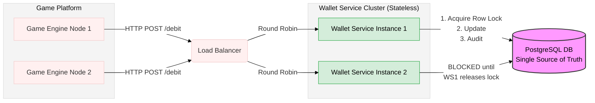

# Game Wallet Service


A high-performance, concurrent, and idempotent wallet service designed for seamless integration with game engines. Built with **Kotlin**, **Spring Boot 3**, and **PostgreSQL**.

## 📋 Table of Contents
- [Architecture & Design](#-architecture--design)
- [Security & Setup](#-security--setup)
- [API Documentation](#-api-documentation)
- [Integration Guide](#-integration-guide-for-game-engines)
- [How to Run (Application)](#-how-to-run-application)
- [How to Run (Tests)](#-how-to-run-tests)
- [Developer Documentation](#-developer-documentation)
- [CI/CD](#-cicd)

---

## 🏗 Architecture & Design

The service is designed as a stateless, horizontally scalable tier that relies on the database for state consistency.



This architecture ensures that while the application tier can scale to handle thousands of incoming HTTP requests, the final decision on balance modification happens sequentially at the database level per player.

### Key Technical Decisions
1.  **Concurrency Safety (Pessimistic Locking):**
    To prevent "double-spending" race conditions (e.g., a player clicking "Buy" twice instantly), the system uses `PESSIMISTIC_WRITE` locks (`SELECT ... FOR UPDATE`) on the `Player` entity during transactions.

    The diagram below illustrates how the database serializes two simultaneous requests. Request B is physically blocked until Request A commits:

    ```mermaid
    sequenceDiagram
        autonumber
        participant ThreadA as Thread A (Req 1: Debit €10)
        participant DB as PostgreSQL Row (Player ID: 123)
        participant ThreadB as Thread B (Req 2: Debit €20)

        Note over ThreadA, ThreadB: Initial DB Balance: €100

        par Simultaneous Start
            ThreadA->>DB: BEGIN TX
            ThreadB->>DB: BEGIN TX
        end

        rect rgb(240, 248, 255)
        note right of ThreadA: Critical Section Starts
        ThreadA->>DB: SELECT ... FOR UPDATE (Acquire Lock)
        activate DB
        DB-->>ThreadA: OK. Current Balance: €100
        end

        rect rgb(255, 245, 245)
        note right of ThreadB: Attempt to Acquire Lock
        ThreadB->>DB: SELECT ... FOR UPDATE
        Note left of DB: ⚠️ DB BLOCKS Thread B<br/>Row is locked by Tx A
        end

        ThreadA->>ThreadA: Calc: 100 - 10 = €90
        ThreadA->>DB: UPDATE player SET balance = 90
        ThreadA->>DB: INSERT audit log...
        ThreadA->>DB: COMMIT TX
        deactivate DB
        note right of DB: 🔓 Lock Released

        rect rgb(240, 248, 255)
        note right of ThreadB: Critical Section Starts
        DB-->>ThreadB: OK (Unblocked). Current Balance: €90
        ThreadB->>ThreadB: Calc: 90 - 20 = €70
        ThreadB->>DB: UPDATE player SET balance = 70
        ThreadB->>DB: INSERT audit log...
        ThreadB->>DB: COMMIT TX
        end

        Note over ThreadA, ThreadB: Final DB Balance: €70 (Both succeeded sequentially)
    ```

2.  **Idempotency:**
    The API is fully idempotent. The client-provided `transactionId` is mapped directly to the database Primary Key.
    * **Scenario:** If a Game Engine sends a request, times out, and retries with the same ID, the service detects the existing record and returns the *original* result without re-processing the money movement.

3.  **Auditability:**
    The `WalletTransaction` table acts as an immutable ledger. Balance changes are calculated and verified against this append-only history.

## 🔐 Security & Setup

This application uses SSL (HTTPS). For security reasons, the keystore is **not** committed to the repository.

### Prerequisites
* **Java 17** (JDK)
* **Docker** (Required for Database and Integration Tests)

### 1. Generate Development Certificate
Before running the application (locally or via Docker), you **must** generate a self-signed certificate:

```bash
mkdir -p src/main/resources
keytool -genkeypair -alias wallet -keyalg RSA -keysize 2048 \
  -storetype PKCS12 -keystore src/main/resources/keystore.p12 \
  -validity 3650 -storepass changeit -dname "CN=localhost"
```

### 2. Configure Environment Variables
Create a .env file in the project root to secure your database credentials. **Do not commit this file**.

```bash
POSTGRES_USER=wallet_user
POSTGRES_PASSWORD=ChangeThisToSomethingStrong!
POSTGRES_DB=wallet
SPRING_PROFILES_ACTIVE=prod
```

## 📖 API Documentation
The service exposes a secure HTTPS API.

* **Base URL:** `https://localhost:8443/api/v1/wallet`
* **Swagger UI:** [https://localhost:8443/swagger-ui.html](https://localhost:8443/swagger-ui.html) (Interactive Docs)

### 1. Debit (Purchase)
Deducts funds from the player's wallet. Returns `402 Payment Required` if funds are insufficient.

* **Request:** `POST /debit`
* **Body:**
```json
{
  "transactionId": "123e4567-e89b-12d3-a456-426614174000",
  "playerId": "e0e0e0e0-e0e0-e0e0-e0e0-e0e0e0e0e0e0",
  "amount": 10.50
}
```
* **Response (200 OK):**
```json
{
  "transactionId": "123e4567-e89b-12d3-a456-426614174000",
  "balance": 89.50
}
```
### 2. Credit (Win/Deposit)
Adds funds to the player's wallet.

* **Request:** `POST /credit`

* **Body:**
```json
{
  "transactionId": "987fcdeb-51a2-43d1-a456-426614174000",
  "playerId": "e0e0e0e0-e0e0-e0e0-e0e0-e0e0e0e0e0e0",
  "amount": 50.00
}
```
* **Response (200 OK):**
```json

{
  "transactionId": "987fcdeb-51a2-43d1-a456-426614174000",
  "balance": 139.50
}
```

## 🎮 Integration Guide for Game Engines

### Authentication
The API requires Mutual TLS (mTLS) or simple HTTPS. Ensure your game server trusts the self-signed certificate located in `src/main/resources/keystore.p12` during development.

### Handling Idempotency
The Game Engine **must** generate a unique UUID for every logical transaction (e.g., "Purchase Item X").
* **Retry Policy:** If the Wallet Service returns `500` or times out, the Game Engine **must** retry with the **SAME** `transactionId`.
* **Conflict:** If you receive `409 Conflict`, you are reusing an ID for a *different* operation. Generate a new ID.

### Error Handling
| Code | Meaning | Action |
| :--- | :--- | :--- |
| `402` | Insufficient Funds | Show "Not enough gold" UI to player. |
| `200` | Success | Grant item to player. |

## 🚀 How to Run (Application)
The easiest way to run the full environment (App + Postgres) is using Docker Compose.

### Option 1: Docker Compose (Recommended)
This builds the application and spins up a PostgreSQL container.

```bash
docker-compose up --build
```
The API will be available at: https://localhost:8443

The Database runs on port: 5432

### Option 2: Run Locally (with local DB)
If you want to run the JAR file directly:

1.  **Start a Postgres database:**
```bash
docker run --name wallet-db -e POSTGRES_PASSWORD=password -e POSTGRES_DB=wallet -p 5432:5432 -d postgres:15
```
2.  **Run the application:**
```bash
./gradlew bootRun
```

---

## 🧪 How to Run (Tests)
This project maintains **100% Test Coverage** across Unit and Integration tests.

### Running the Suite
Integration tests use **Testcontainers** to spin up a real PostgreSQL instance on a random port. Docker must be running.

```bash
./gradlew clean test
```

### Test Strategy
* **Unit Tests:** JUnit 5 & Mockito for business logic and edge cases.
* **Integration Tests:** `WalletIntegrationTest` verifies the full stack (Controller -> Service -> DB) including concurrency locking and SQL constraints using a real Dockerized database.

---

## 📚 Developer Documentation

Beyond this README, the project maintains detailed internal documentation for maintainers.

### 1. Code-Level Documentation (KDoc)
We use **KDoc** and **Dokka** to generate browsable API documentation (similar to Javadoc).
To generate the site locally:

```bash
./gradlew dokkaHtml
```
* Open build/dokka/index.html in your browser to view the documentation.

### 2. Architecture & Decisions

* [concurrency-strategy.md](docs/adr/concurrency-strategy.md) - Analysis of locking strategies and the decision to use Pessimistic Locking.
* [api-design.md](docs/api-design.md) - Detailed breakdown of REST endpoints and error handling standards.
* [database-design.md](docs/database-design.md) - Schema definitions and SQL constraints.

## ⚙️ CI/CD
A GitHub Actions pipeline is configured in `.github/workflows/pipeline.yml`. Every push to `main` or feature branches triggers:
1.  Setup of Java 17 environment.
2.  Execution of the full Gradle test suite.
3.  Verification of build stability.