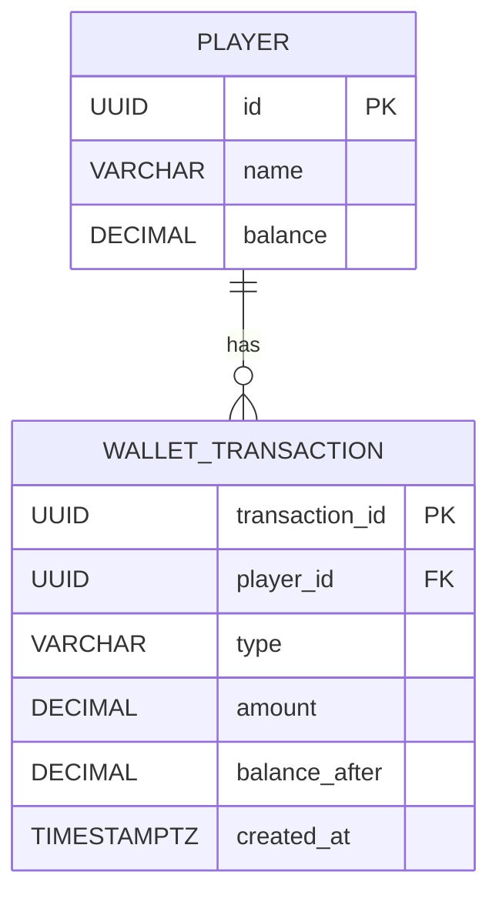

# Database Design

## Overview
The system uses **PostgreSQL** (running via Docker) as the relational database. This ensures strict ACID compliance and supports row-level locking (`SELECT ... FOR UPDATE`) required for handling concurrent financial transactions.

* **Database Engine:** PostgreSQL 15
* **Orchestration:** Docker Compose
* **Schema Management:** SQL (schema.sql)

### Currency Scope

This schema assumes a single implicit currency (e.g. EUR).
Multi-currency support is outside the scope of this exercise.

Balances and amounts use two decimal places (DECIMAL(20,2)), supporting EUR; adjust precision if sub-cent currencies are needed.

## ER Diagram

## Schema Implementation

### 1. Table: `player` (Pelaaja)
Stores the current state of the player's account.

| Column    | Type           | Constraints | Description                            |
|-----------|----------------|-------------|----------------------------------------|
| `id`      | UUID           | PK          | Unique player identifier               |
| `name`    | VARCHAR(255)   | NOT NULL    | Player name                            |
| `balance` | DECIMAL(20, 2) | NOT NULL    | Current wallet balance (Default: 0.00) |

**Constraints:**
* `CHECK (balance >= 0)`: Database-level enforcement to prevent negative balances.

### 2. Table: `wallet_transaction` (Pelitapahtuma)

An immutable audit log of all financial movements.  
Each row represents a single debit or credit operation and also acts as the
idempotency record for the HTTP API. Records in this table are immutable and must never be updated or deleted.

| Column           | Type            | Constraints        | Description                                     |
|------------------|-----------------|--------------------|-------------------------------------------------|
| `transaction_id` | UUID            | PK                 | Unique transaction identifier (idempotency key) |
| `player_id`      | UUID            | FK, IDX            | Reference to player.id; part of composite index (player_id, created_at DESC) for faster player history lookup|
| `type`           | VARCHAR(20)     | NOT NULL, CHECK    | Transaction type: `DEBIT` or `CREDIT`           |
| `amount`         | DECIMAL(20, 2)  | NOT NULL, CHECK    | Transaction amount (must be > 0)                |
| `balance_after`  | DECIMAL(20, 2)  | NOT NULL           | Player balance after the transaction            |
| `created_at`      | TIMESTAMPTZ     | NOT NULL          | Transaction timestamp (UTC)                     |

**Constraints:**
* `CHECK (amount > 0)`
* `CHECK (type IN ('DEBIT', 'CREDIT'))`
* `transaction_id` is unique and used to guarantee idempotency
* `player_id` is a foreign key referencing `player.id`
* Indexed via idx_transaction_player_time composite index (player_id, created_at DESC) for faster player history lookup
* created_at is stored in UTC

## Concurrency and Consistency

All balance updates are expected to be performed within a single database
transaction. 

The player's row should be locked using `SELECT ... FOR UPDATE` to prevent race conditions when 
processing concurrent debit or credit requests.

The primary key constraint on transaction_id guarantees idempotency at the database level.

The default `READ COMMITTED` isolation level is sufficient when combined with
row-level locking on the player record.

The `wallet_transaction` table serves as an immutable audit log and enables
safe idempotent request handling.